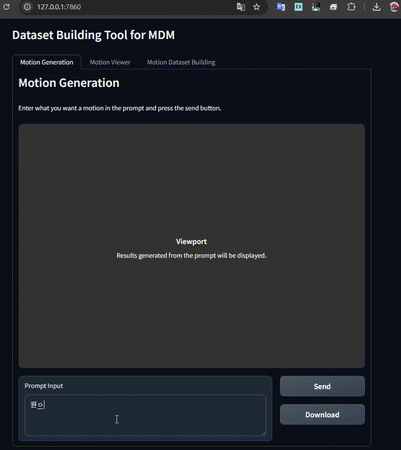
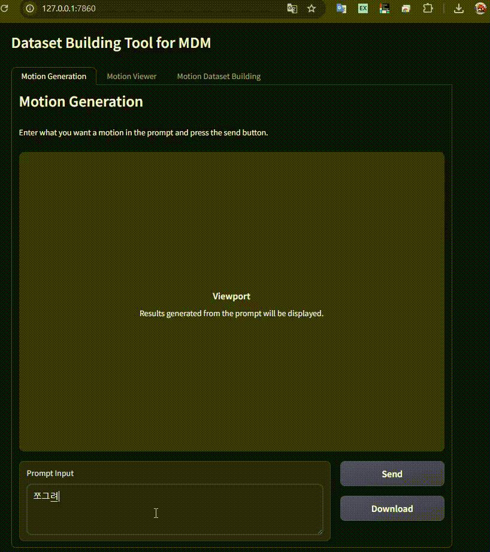
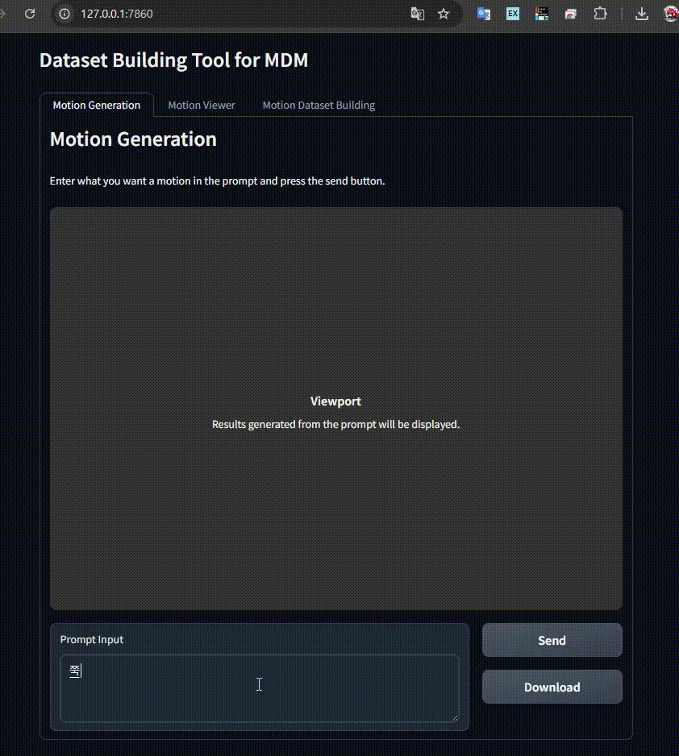
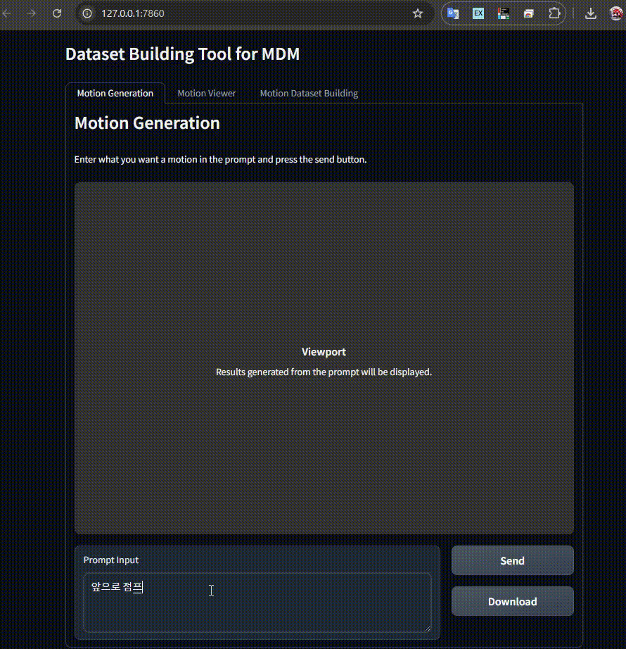

# DBT(Dataset Building Tool for MDM)

**DBT** 프로젝트는 MDM([Motion Diffusion Model](https://github.com/GuyTevet/motion-diffusion-model) ) 학습에 필요한 데이터셋을 구축하는데 필요한 기능을 제공합니다.

또한 구축된 데이터셋을 보다 쉽게 훈련시키고 결과를 API로 볼 수 있도록 하기 위해 [MDM_Model 프로젝트](https://github.com/google-ml-bc-2nd-2025/MDM_model)를 구축해 손쉽게 연동하여 학습된 데이터를 이용해 애니메이션을 생성해 볼 수 있습니다.

실행된 MDM_model 서버의 endpoint를 `.env` file에 다음과 같이 설정하면 바로 애니메이션을 생성해 볼 수 있습니다.

    LANGUAGE=en
    GEN_ENDPOINT=http://localhost:8384/predict

## 🏗 Motion Dataset Building 

MDM 학습을 위한 데이터 셋 구축 데이터입니다. 모션 데이터를 HumanML3D로 변환하고 각 구간 별 라벨링 설정을 할 수 있습니다.

라벨링은 '[텍스트 조건 기반 모션 생성 모델(Text-Conditional Motion Generation Model)](https://arxiv.org/abs/2305.09662)'에 기반해 작성됩니다. 세분화된 동작 구분에 대한 성능 개선에 대한 보다 상세한 내용은 [Enhanced Fine-grained Motion Diffusion for Text-driven Human Motion Synthesis](https://arxiv.org/abs/2305.13773v2)을 참고하세요.

    모션 재생을 위한 기본 스킨 데이터는 /src/static/tpose.glb 파일을 사용합니다. 이 파일을 원하는 스킨 파일로 교체 가능합니다.

###  📁 학습 데이터셋 목록

학습 데이터셋 목록에서 하나를 선택하면 모션을 상단 화면에서 볼 수 있으며 라벨을 수정할 수 있습니다.

`src/dataset` 에 학습 테스트를 위한 샘플 파일이 추가되어 있으니 참고하세요.

### 📝 상세 설명

* **데이터셋 디렉토리 경로**에 데이터셋을 위한 모션 데이터 파일들이 있는 폴더를 지정 후 **새로고침** 누르면 **학습 데이터셋 목록**이 갱신됩니다.
* 라벨링은 다음과 같은 내용이 포함되어야 합니다.
    * `text` : 모션에 대한 설명 텍스트를 입력합니다.
    * `time tag` : text의 모션에 대한 시간 구간을 입력합니다. #0.0#0.1과 같이 기록합니다. 
    * `모션 라벨` : 입력창에 한 라인에 하나의 text와 time tag를 기록하세요.
* 라벨을 기록 후 **설명 업데이트** 버튼을 누르면 기록한 내용이 저장됩니다.
* **학습 파일 생성**을 누르면 해당 모션에 대해서만 학습용 데이터 파일을 생성합니다.
* **학습 파일 통합 생성**을 누르면 등록된 모든 모션과 라벨링 데이터를 하나의 pt 파일로 생성합니다.

## ✨ Motion Generation

[MDM_Model 프로젝트](https://github.com/google-ml-bc-2nd-2025/MDM_model)에 요청해 원하는 모션을 생성하고 볼 수 있습니다.

* `.env` 파일에서 `GEN_ENDPOINT`의 값을 MDM Clone 프로젝트에서 오픈한 주소와 포트를 명시하세요.
* 프롬프트를 입력 후 **생성** 버튼을 누르면 MDM 서버에서 humanML3D 포멧으로 생성된 모션 데이터를 받아옵니다.
* 필요하다면 **다운로드** 버튼을 눌러 생성된 모션 데이터를 저장하세요.
* 생성 예

## 🕹 Motion Viewer

### ✅ 여러 포멧의 모션 데이터를 볼 수 있습니다.

* **GLB** 포멧 : 스킨과 모션 파일을 별도로 지정하여 볼 수 있습니다. 모션 데이터를 우선 설정 후 스킨 데이터를 지정하세요.
* **BVH**, **HumanML3D**(`npy`-`(n,22,3)`) 포멧 : 모션 파일만 지정하면 볼 수 있습니다.

### ⚙️ 보기 옵션

* **마우스 좌측 버튼** : 카메라 회전
* **마우스 우측 버튼** : 카메라 이동
* **마우스 휠** : 카메라 줌 인/아웃
* **'일시정지' 버튼** : 모션을 정지
* **모션 프레임 슬라이드 바** : 프레임을 직접 제어
* **'속도' 슬라이드 바** : x0.1 ~ x2 까지 모션 속도를 제어
* **'시점 리셋' 버튼** : 카메라를 최초의 위치로 조정
* **'본 인덱스 보기/숨기기' 버튼** : joint를 구체를 이용해 표기
