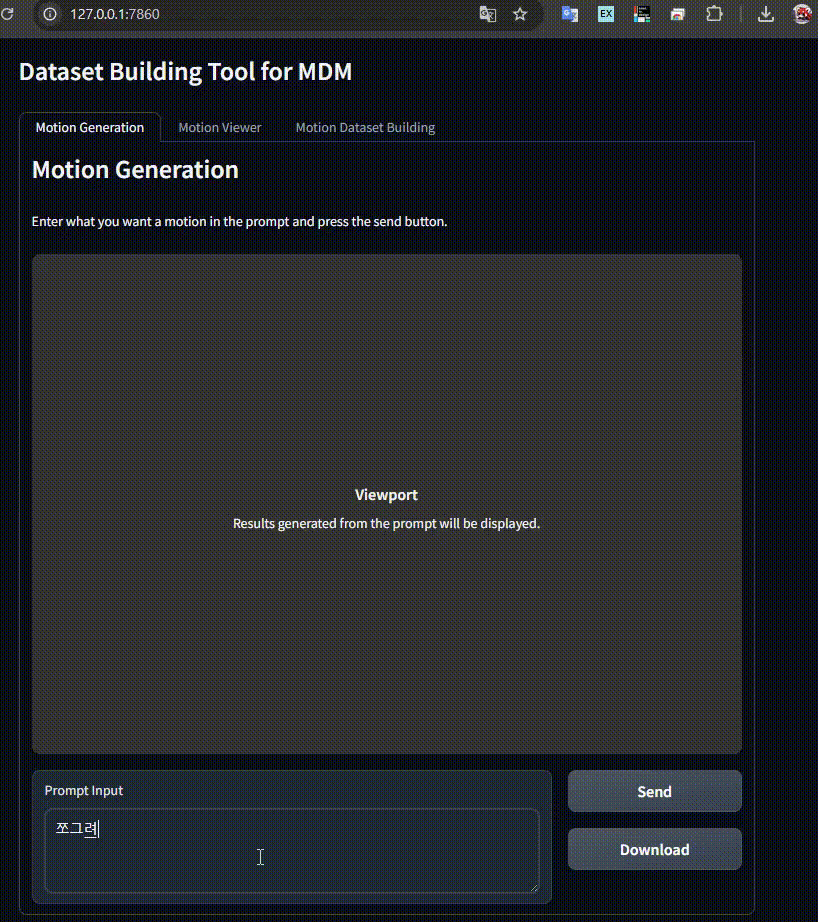
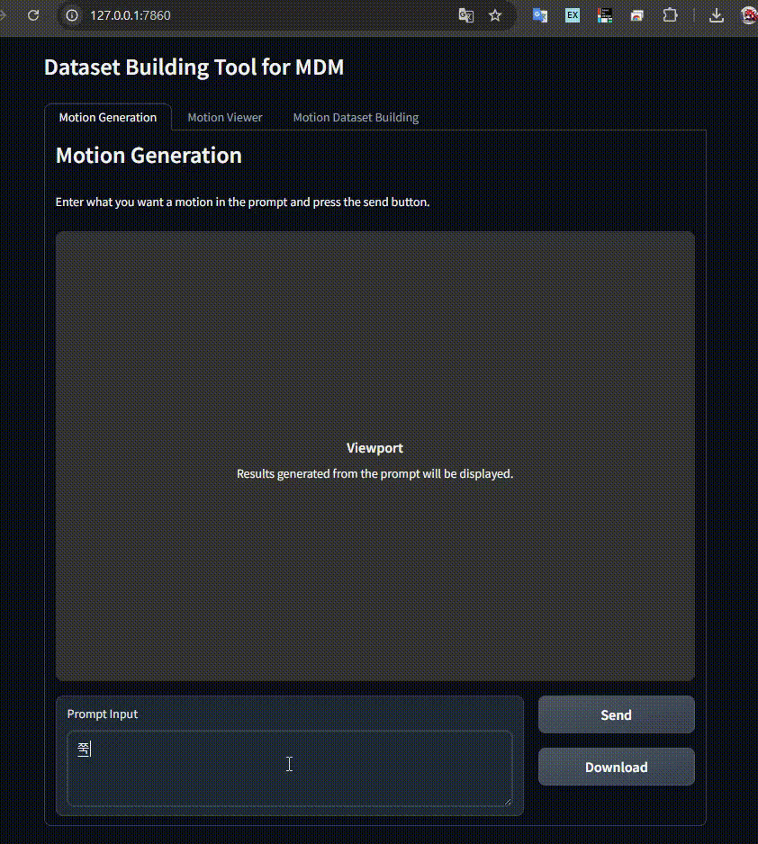

# DBT (Dataset Building Tool for MDM)

The **DBT** project provides tools for building datasets required to train the [Motion Diffusion Model (MDM)](https://github.com/GuyTevet/motion-diffusion-model).

In addition, we provide a [MDM_Model](https://github.com/google-ml-bc-2nd-2025/MDM_model) that makes it easy to train the model using your datasets and generate animations through a simple API integration.

To enable animation generation using your trained model, set the following in your `.env` file:

    LANGUAGE=en
    GEN_ENDPOINT=http://localhost:8384/predict

## 🏗 Motion Dataset Building

This tool helps you build datasets to train MDM by converting motion data into HumanML3D format and enabling label-based segmentation.

Labeling follows the structure of the '[Text-Conditional Motion Generation Model](https://arxiv.org/abs/2305.09662). For more advanced and fine-grained motion segmentation techniques, refer to [Enhanced Fine-grained Motion Diffusion for Text-driven Human Motion Synthesis](https://arxiv.org/abs/2305.13773v2).

    The default skin for motion playback is provided in /src/static/tpose.glb. You can replace it with your own character file.

###  📁 Dataset List

Select a dataset from the list to preview the motion and edit the labels.
You can find sample motion data in src/dataset for testing.

### 📝 Detailed Instructions

* Click **Refresh** after setting the **Dataset Directory Path** to update the dataset list.
* Labels must include:
    * `text` : A description of the motion.
    * `time tag` : A timestamp range in the format #start#end (e.g., #0.0#0.1).
    * `motion label` : Each label should be written in a single line within the motion label input box.
* Click **Update Description** to save the entered labels.
* Click **Generate Training File** to create training data for the selected motion.
* Click **Generate All Training Files** to combine all labeled motions into a single `.pt` training file.

## ✨ Motion Generation

You can request motion generation from the [MDM Fork 프로젝트](https://github.com/google-ml-bc-2nd-2025/MDM_model).

* In your `.env` file, set the `GEN_ENDPOINT` to the address and port of your running MDM server.
* After entering a prompt, click **Generate** to request motion data in HumanML3D format from the server.
* Click **Download** to save the generated motion if needed.
* Examples:

## 🕹 Motion Viewer

### ✅ Supported Formats

* **GLB** : Load motion and skin files separately (load motion first, then skin).
* **BVH** and **HumanML3D** (NumPy `.npy` of shape `(n, 22, 3)`): Load motion file only.

### ⚙️ Viewer Controls

* **Left Mouse Button**: Rotate camera
* **Right Mouse Button**: Move camera
* **Mouse Wheel**: Zoom in/out
* **Pause**: Pause the motion
* **Frame Slider**: Manually control frame playback
* **Speed Slider**: Control speed (x0.1 to x2)
* **Reset View**: Reset camera to default position
* **Show/Hide Joint Indices**: Toggle joint spheres on/off
